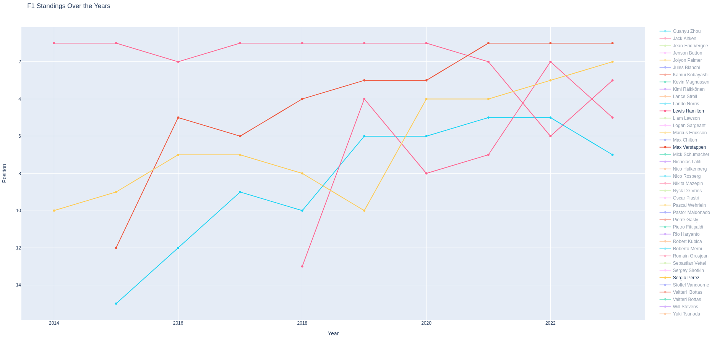

# Webscraper F1 Standings
As of now, the repository only has a python script that **scrape_standings.py** that scrapes Formula 1 driver standings from the official [Formula 1 website](https://www.formula1.com/en/results.html/2023/drivers.html) and visualizes it using [Plotly Express](https://plotly.com/python/plotly-express/)

## Prerequisites
Make sure to have the following Python libraries installed:


```bash
pip install requests beatifulsoup4 pandas plotly numpy
```

- **requests**: Used for making HTTP requests
- **beautifulsoup4**: A library for pulling data out of HTML and XML files. Webscraping
- **pandas**: Data manipulation library
- **plotly**: Graphing library for interactive visualizations
- **numpy**: Additional data manipulation


